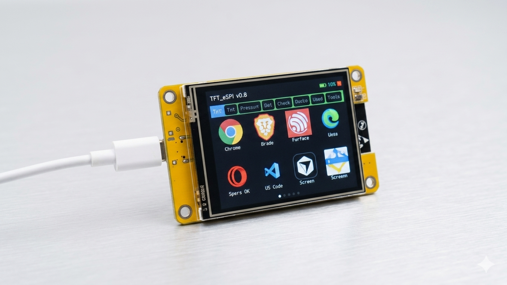

# ControlPC Ultimate v2.0

A full **Desktop Companion System** for the **ESP32-2432S028R (Cheap Yellow Display)**.
Tap an icon to open apps on your Windows PC. Swipe through 50+ apps, control media, monitor system stats — all from a 2.8" touchscreen.

---

## What's new in v2.0

| Feature | v1 | v2 |
|---|---|---|
| Apps | 12 (hardcoded) | 55+ (extensible database) |
| Pages | 2 | Dynamic (auto-paged by category) |
| Categories | None | All / Favorites / Browsers / Dev / Games / Media / Comm / Tools / System / Office / Recent |
| Search | None | On-screen QWERTY keyboard |
| Media control | None | Play/Pause / Prev / Next / Volume |
| System stats | None | CPU / RAM / GPU / Disk / Network / Volume |
| System commands | None | Lock / Sleep / Shutdown / Restart / Screenshot |
| UI | Static grid | Dark theme, category bar, status bar, quick settings |
| Architecture | Single .ino | Modular headers (UI/, System/, AppDB.h) |
| FreeRTOS | No | Stats task + serial task on separate cores |

---

## Hardware required

| Part | Details |
|---|---|
| Board | ESP32-2432S028R (CYD, 2.8" ILI9341 + XPT2046) |
| PC | Windows 10/11, USB cable |
| Arduino IDE | 2.x |
| Python | 3.9+ |

---

## Arduino libraries required

Install in Arduino IDE → **Sketch → Include Library → Manage Libraries**:

- **TFT_eSPI** (Bodmer)
- **XPT2046_Touchscreen**
- **ArduinoJson** (Benoit Blanchon)

Configure `TFT_eSPI/User_Setup.h` for the CYD exactly as in v1 (ILI9341, correct pins).

---

## File structure

```
ControlPC_Ultimate_v2/
├── controlPC.ino          # Main sketch — upload this
├── Config.h               # All pins, constants, UIState, ScreenID
├── AppDB.h                # Application database (add apps here)
├── icons.h                # 56×56 PROGMEM icon bitmaps
│
├── UI/
│   ├── Theme.h            # Dark theme color palette (RGB565)
│   ├── StatusBar.h        # Top bar: title, WiFi, CPU%, RAM%
│   ├── CategoryBar.h      # Horizontal category pill filter
│   ├── AppGrid.h          # 4×2 icon grid, swipe, letter-icon fallback
│   ├── QuickSettings.h    # Swipe-down overlay: volume, brightness, nav
│   └── SearchPanel.h      # QWERTY search + live results
│
├── System/
│   ├── TouchHandler.h     # Unified touch routing (tap / swipe / hold)
│   ├── Serial.h           # PC→ESP32 command parser (STAT:, TRACK:, VOL:)
│   └── Stats.h            # Stats panel drawing + GET_STATS requester
│
├── pc_listener.py         # Windows companion — handles all commands
├── requirements.txt       # pyserial, psutil, pywin32, pycaw
└── start_listener.bat     # Double-click to install deps and run
```

---

## Setup

### 1. Arduino (one time)

1. Install libraries listed above.
2. Configure `TFT_eSPI/User_Setup.h` for your CYD board (ILI9341, landscape).
3. Open `controlPC.ino` (folder name must match: `ControlPC_Ultimate_v2/controlPC.ino`).
4. Set WiFi credentials in `Config.h` (optional — leave blank to skip).
5. Upload to CYD.

### 2. Python listener

```powershell
cd path\to\ControlPC_Ultimate_v2
python -m pip install -r requirements.txt
```

Or double-click **`start_listener.bat`**.

Edit COM port in `start_listener.bat` or pass as argument:
```powershell
python pc_listener.py COM5
```

### 3. Daily use

1. Plug in CYD via USB.
2. **Do not** open Arduino Serial Monitor.
3. Run `start_listener.bat` (or `python pc_listener.py COM3`).
4. Use the touchscreen.

---

## Touch gestures

| Gesture | Action |
|---|---|
| Tap icon | Launch app |
| Swipe left/right on grid | Next/previous page |
| Tap category pill | Filter by category |
| Swipe down from status bar | Open Quick Settings |
| In Quick Settings: tap Back | Return to home |
| In Quick Settings: tap Media | Open media controls |
| In Quick Settings: tap Stats | Open system stats |
| In Quick Settings: tap Search | Open search |
| In Search: type letters | Filter apps live |
| In Search: tap result row | Launch app |

---

## Adding a new app

1. **`AppDB.h`** — add one line to `APP_DB[]`:
   ```cpp
   { "My App", "OPEN_MYAPP", CAT_TOOLS, nullptr, 0xFD20, false },
   ```
   Use `nullptr` for the icon — a colored letter tile is drawn automatically.
   Supply a PROGMEM `uint16_t[]` in `icons.h` if you have a bitmap.

2. **`pc_listener.py`** — add a handler function and register it in `HANDLERS`:
   ```python
   def open_myapp():
       p = first_existing([r"C:\Program Files\MyApp\MyApp.exe"])
       launch(p, "My App") if p else print("MyApp not found")

   HANDLERS["OPEN_MYAPP"] = open_myapp
   ```

That's it. No other files need changes.

---

## System stats protocol

The Python listener pushes stats every 5 seconds (and on demand when ESP32 sends `GET_STATS`):

```
STAT:cpu,ram,gpu,disk,netkbps,volume\n
TRACK:Artist - Song Title\n
VOL:75\n
```

Install optional deps for full stats:
```powershell
pip install psutil pywin32 pycaw comtypes
```

---

## Troubleshooting

| Problem | Fix |
|---|---|
| Upload fails | Hold BOOT on upload; try 115200 baud; use data USB cable |
| Serial error / port busy | Close Serial Monitor; only one app can use COM port |
| No stats showing | Install psutil: `pip install psutil` |
| Media keys not working | Install pywin32: `pip install pywin32` |
| App not found | Check path in `pc_listener.py`, restart listener |
| Wrong icon colors | Regenerate `icons.h` with `tools/generate_icons.py` |
| Display upside down | Change `SCREEN_ROTATION` and `TOUCH_ROTATION` in `Config.h` |

---

## License

Part of [-CYD-2432S028R-controlPC](https://github.com/wewe97z/-CYD-2432S028R-controlPC/tree/main).wewe97z.
